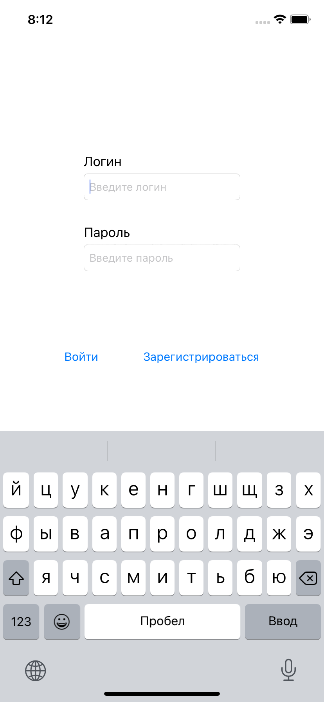
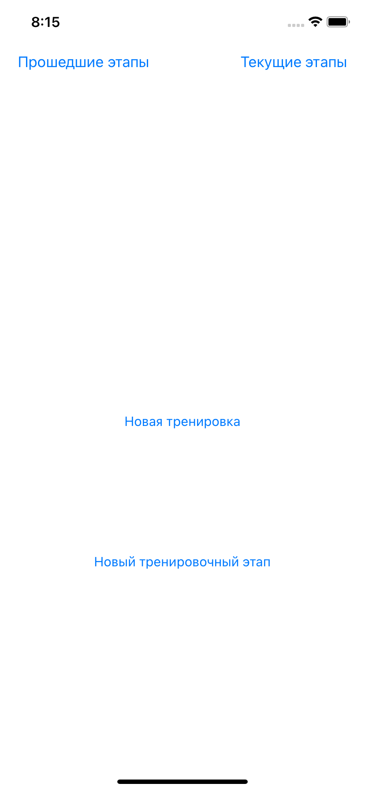
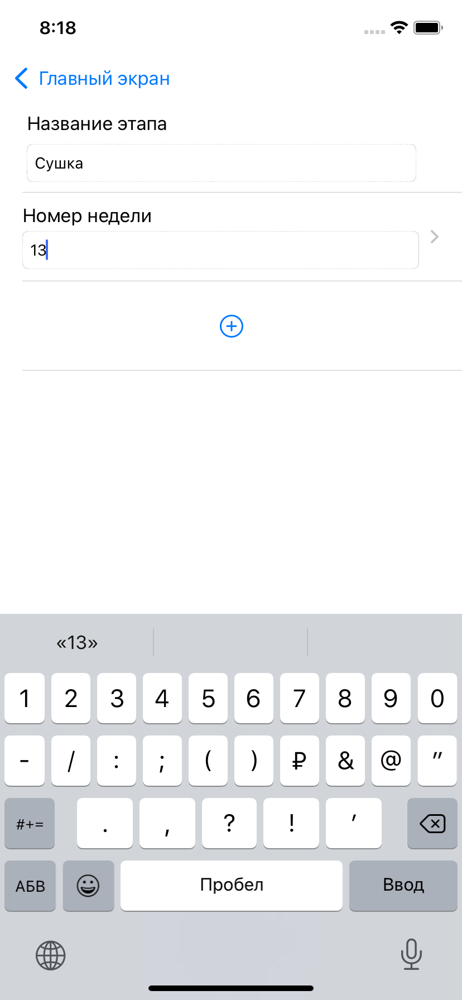
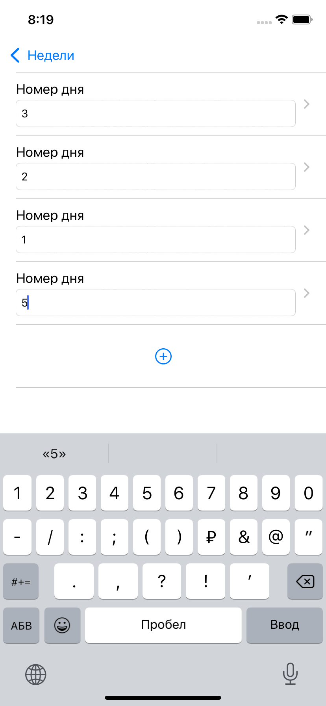
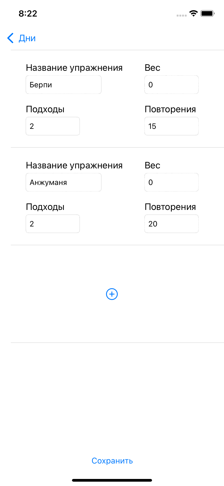
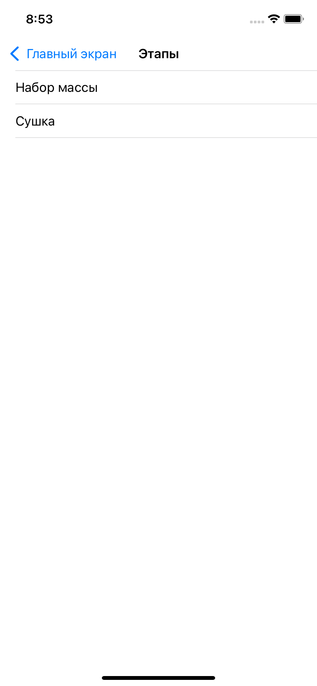
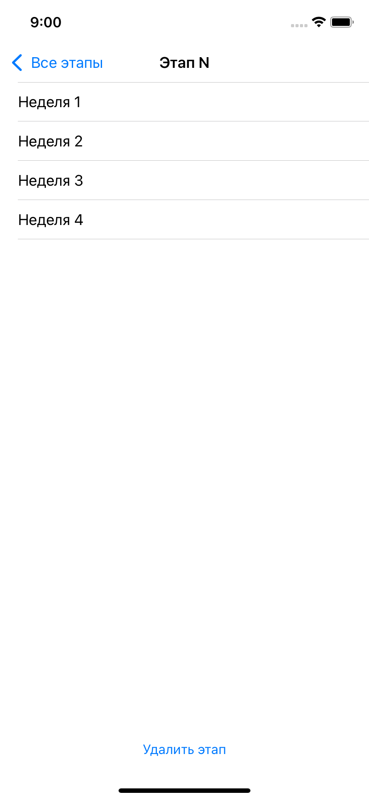

# Gym - App for athletes
> Приложение, помогающее спортсменам отслеживать и составлять планы тернировок.
> Проект-практическая работа по дисциплине "Мобильные приложения".

## Table of Contents
* [General Info](#general-information)
* [Screenshots](#screenshots)
* [Project Status](#project-status)
* [Contact](#contact)

## General Information
- Тренировочный процесс разделяется на этапы, каждый из которых составлен из планов тренировок по неделям и дням
- За сервер отвечала не я, и разворачивался он локально, поэтому использовали ngrok
- Проект писался на коленке, за неделю до сдачи
- Здесь представлена зачтенная преподом версия

## Screenshots

## Project Status
Разработка проекта больще не ведется, но я бы многое поменяла

## Contact

